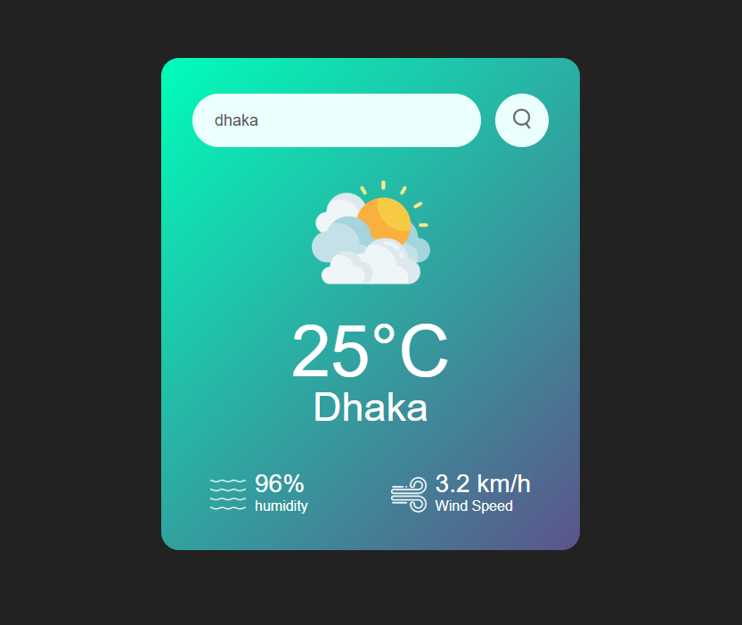
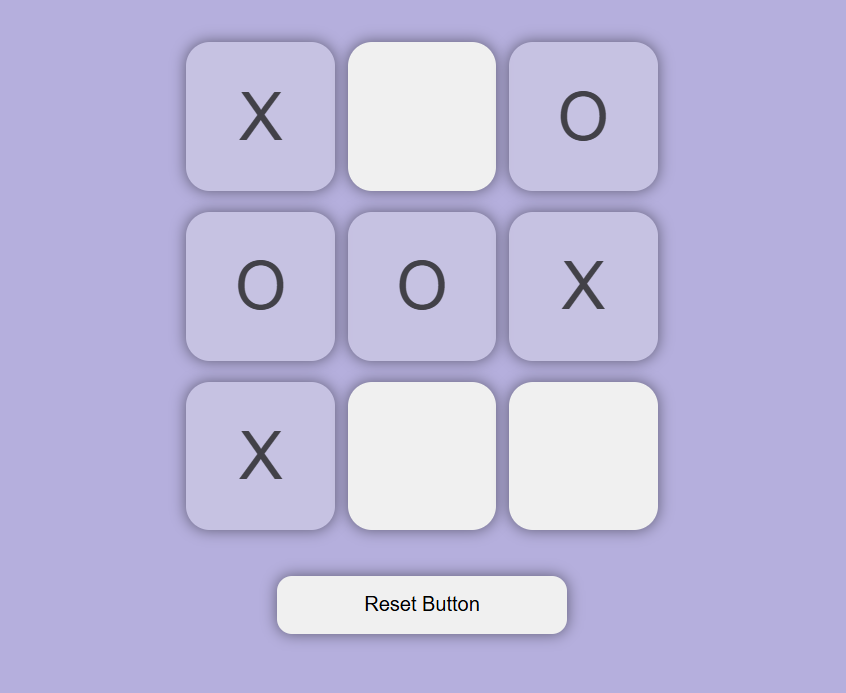
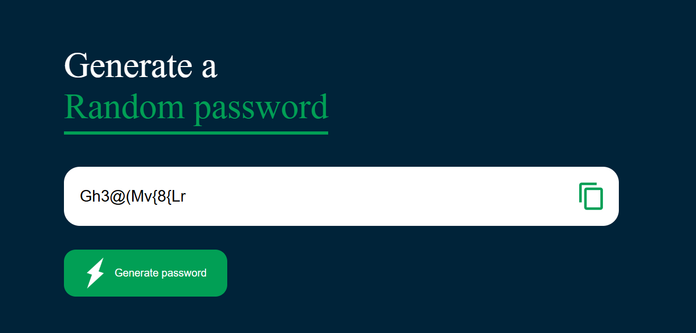

# 🚀 30 Days JavaScript Projects Challenge

Welcome to my **30 Days JavaScript Projects Challenge**!  
Every day, I build a new mini project using HTML, CSS, and JavaScript to improve my web development skills.

## 🔥 Completed Projects

---

## 📅 Day 1: Digital Clock

A live digital clock that updates every second using JavaScript.

#### 🛠️ Features:
- Real-time clock
- Uses system time
- Clean, minimal design
 <!-- Replace with actual image -->

## 📅 Day 2: currency_converter

A simple and responsive currency converter web app built using HTML, CSS, and JavaScript.  
It fetches real-time exchange rates from the free and open [Fawaz Ahmed Currency API](https://github.com/fawazahmed0/currency-api) and allows users to convert between different currencies with live flag icons.

---

## 🚀 Features

- 🔁 Convert between 100+ currencies
- 📡 Real-time exchange rates using `jsDelivr` CDN
- 🏳️ Auto flag icon updates based on currency
- 🧮 Input validation (no empty/invalid values)
- 🎨 Clean and responsive design

---
 <!-- Replace with actual image -->

## 📅 Day 3:weather App

A simple and clean weather application that shows real-time weather information for any city using the **OpenWeatherMap API**.

 

---

## 🚀 Features

- 🔍 City-based weather search
- 🌡️ Displays temperature in Celsius
- 💧 Shows humidity and wind speed
- 🌤️ Weather icons that change based on current condition
- 📱 Responsive & minimal UI
- 🔁 Real-time updates on user request

---

## 📅 Day 4: Tic Tac Toe Game

A classic Tic Tac Toe game built with HTML, CSS, and JavaScript. Play against a friend in a fun, interactive UI.

---

## 🚀 Features

- 🎮 Two-player local gameplay  
- ✅ Win/tie detection logic  
- 🔄 Reset game functionality  
- ✨ Simple, clean, and responsive design  
- 🎨 Visually highlights winning combinations  
- 📱 Mobile-friendly layout  

---

## 📅 Day 5: Random Password Generator

A clean and responsive web app that generates secure, random passwords with customizable options such as length and character types.

---

## 🚀 Features

- 🔢 Custom password length selection  
- 🔡 Option to include:
  - Uppercase letters
  - Lowercase letters
  - Numbers
  - Symbols  
- 🔒 Strong and secure password generation  
- 📋 One-click copy to clipboard  
- ⚙️ Instant password regeneration  
- 📱 Responsive & modern user interface  

---

## 📅 Challenge Progress

| Day | Project         | Status     |
|-----|------------------|------------|
| 1   | Digital Clock    | ✅ Done     |
| 2   | To-Do App        | ✅ Done     |
| 3   | currency_converter| ✅ Done  |
| 4   | weather App      |✅ Done |
| 5 | tic tac toe          | ✅ Done   |
| 6 | random password generate        | ✅ Done   |
| 30  | Final Project 🎯 | ⏳         |

