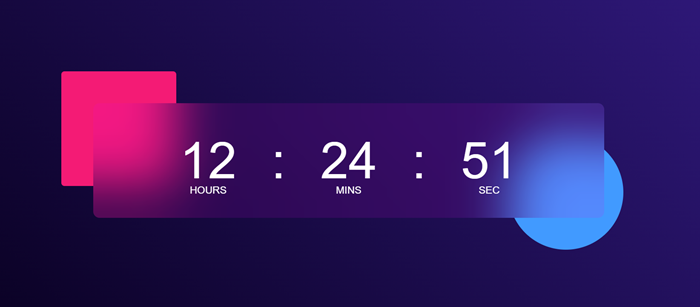
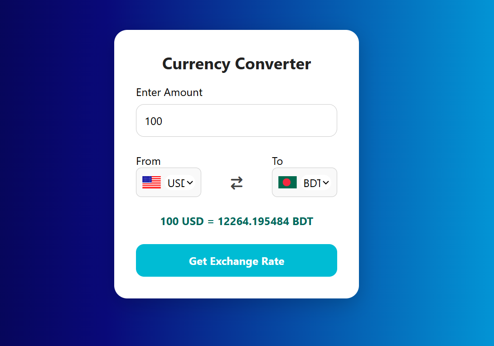

# 🚀 30 Days JavaScript Projects Challenge

Welcome to my **30 Days JavaScript Projects Challenge**!  
Every day, I build a new mini project using HTML, CSS, and JavaScript to improve my web development skills.

## 🔥 Completed Projects

---

### 📅 Day 1: Digital Clock

A live digital clock that updates every second using JavaScript.

#### 🛠️ Features:
- Real-time clock
- Uses system time
- Clean, minimal design
 <!-- Replace with actual image -->
#### 📁 Folder: `Digital_clock`

```bash
Digital_clock/
├── index.html
├── style.css
├── script.js

```
# 📅 Day 2: currency_converter

A simple and responsive currency converter web app built using HTML, CSS, and JavaScript.  
It fetches real-time exchange rates from the free and open [Fawaz Ahmed Currency API](https://github.com/fawazahmed0/currency-api) and allows users to convert between different currencies with live flag icons.

---

## 🚀 Features

- 🔁 Convert between 100+ currencies
- 📡 Real-time exchange rates using `jsDelivr` CDN
- 🏳️ Auto flag icon updates based on currency
- 🧮 Input validation (no empty/invalid values)
- 🎨 Clean and responsive design

---
 <!-- Replace with actual image -->


## 📂 Folder Structure

```bash
Currency_Converter/
├── index.html          # HTML structure
├── style.css           # Styling file
├── script.js           # JavaScript logic
├── codes.js            # Contains countryList (currency → country code)
├── assets/
│   └── currency_converter.png   # Screenshot (add your own image)

```
### 📅 Day 3:weather App

A simple and clean weather application that shows real-time weather information for any city using the **OpenWeatherMap API**.

 

---

## 🚀 Features

- 🔍 City-based weather search
- 🌡️ Displays temperature in Celsius
- 💧 Shows humidity and wind speed
- 🌤️ Weather icons that change based on current condition
- 📱 Responsive & minimal UI
- 🔁 Real-time updates on user request

---

## 📁 Project Structure
```
├── index.html # Main HTML file
├── style.css # App styling
├── script.js # JavaScript logic (API + UI)
├── assets/ # Weather icons
│ ├── clouds.png
│ ├── clear.png
│ ├── rain.png
│ ├── drizzle.png
│ ├── mist.png
│ └── default.png
```


## 📅 Challenge Progress

| Day | Project         | Status     |
|-----|------------------|------------|
| 1   | Digital Clock    | ✅ Done     |
| 2   | To-Do App        | ✅ Done     |
| 3   | currency_converter| ✅ Done  |
| 4   | `Pending`        | 🔜 Coming Soon |
| ... | ...              | ...        |
| 30  | Final Project 🎯 | ⏳         |


